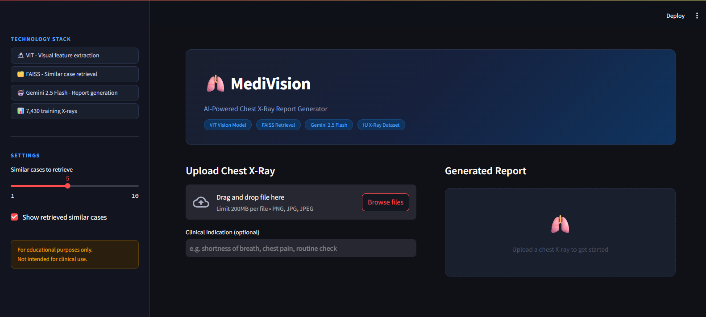
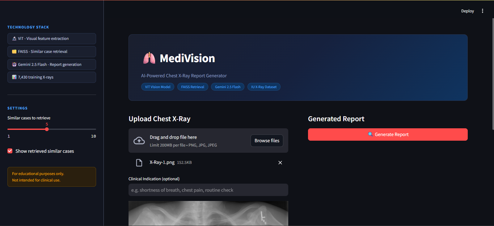
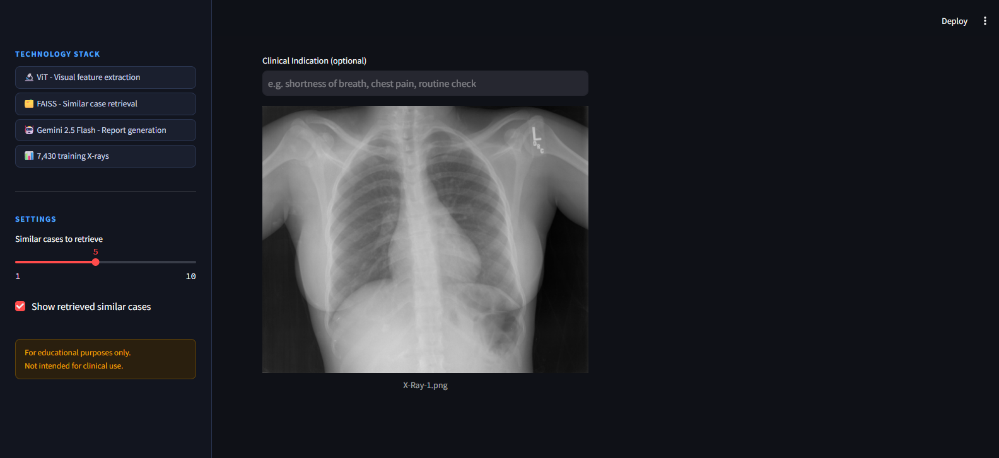
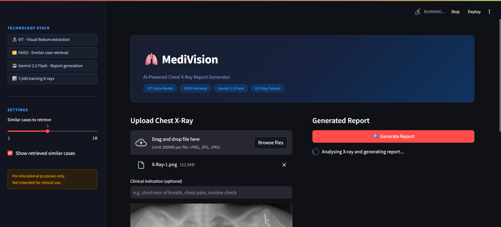
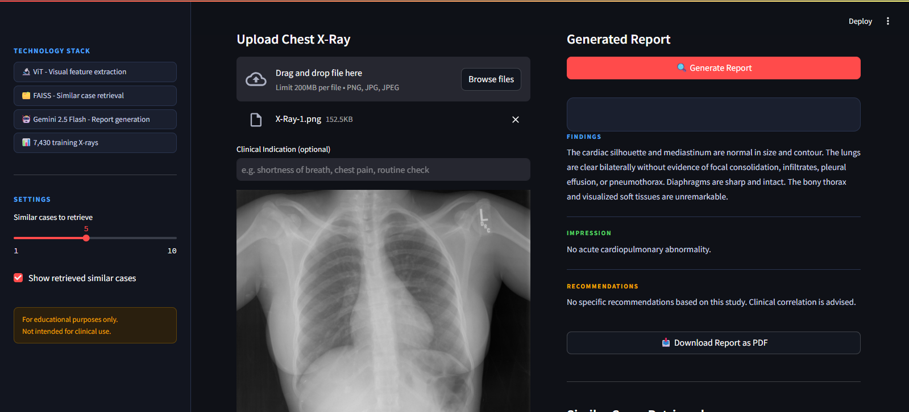
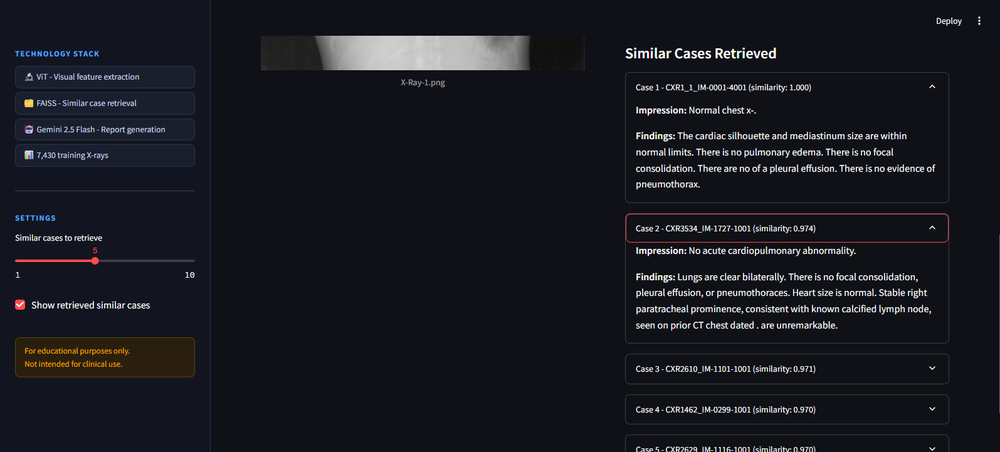
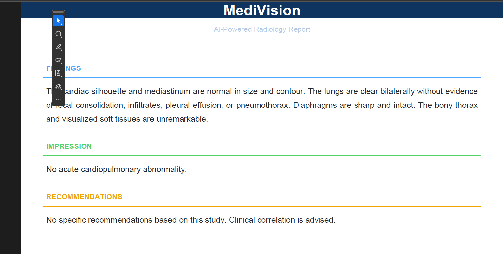

# 🫁 MediVision — AI Radiology Report Generator

Upload a chest X-ray, get a structured radiology report. Built with a Vision Transformer, FAISS retrieval, and Gemini 2.5 Flash.

---

## Screenshots









---

## How it works

1. ViT extracts a 768-dim feature vector from the uploaded X-ray
2. FAISS searches 7,430 training cases for the most visually similar X-rays
3. Their radiology reports are retrieved as context
4. Gemini 2.5 Flash generates a structured report — Findings, Impression, Recommendations

---

## Stack
- **Vision** — ViT (google/vit-base-patch16-224-in21k)
- **Retrieval** — FAISS
- **Generation** — Gemini 2.5 Flash
- **Dataset** — IU X-Ray (NLM Open-i), 7,430 chest X-rays
- **UI** — Streamlit

---

## Setup

```bash
git clone https://github.com/KaveeshaEkanayake/medivision-report-generator.git
pip install torch torchvision transformers pillow pandas faiss-cpu google-genai python-dotenv streamlit fpdf2 tqdm
```

Download the IU X-Ray dataset from [NLM Open-i](https://openi.nlm.nih.gov/faq#collection), extract into `data/images/` and `data/reports/`, add your Gemini API key to `.env`, then:

```bash
python src/preprocess.py
python src/extractor.py
python src/retriever.py
streamlit run src/app.py
```

> Dataset not included — restricted under NLM Open-i data sharing policy.

---

## Related projects
- [Medical Research Assistant](https://medical-research-assistant.streamlit.app/) — RAG with FAISS + Sentence-BERT + Gemini
- [Stroke Prediction ML](https://github.com/KaveeshaEkanayake/stroke-prediction-ml) — Healthcare classification with scikit-learn

---

⚠️ *For educational purposes only. Not for clinical use.*